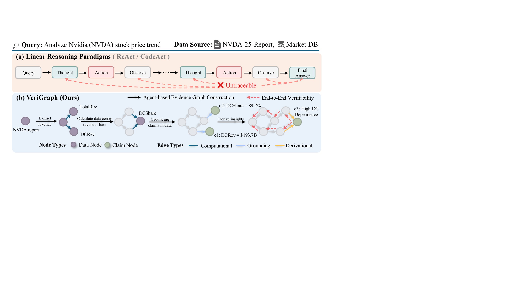
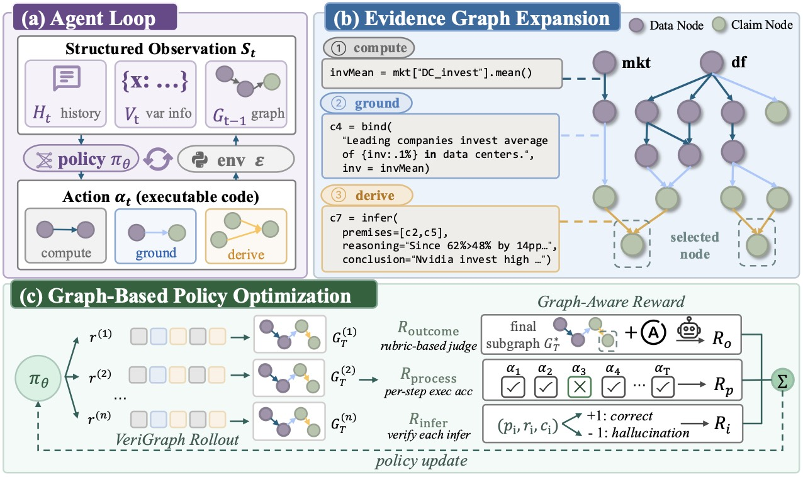

<div align="center">

# 🕸️ VeriGraph: Grounding Agentic Reasoning in Executable Evidence Graphs

<p>
  <a href="#"></a>
  <a href="#"></a>
  <a href="#"></a>
  <a href="#"></a>
  <a href="#"></a>

</p>

<em>A traceable neuro-symbolic agent that builds an <b>executable evidence DAG</b> instead of a linear chain of thought,<br>
trained end-to-end with a <b>graph-aware composite reward</b>.</em>

</div>

---

## 💡 Overview

LLM agents on data-intensive tasks usually emit a single text trajectory that entangles deterministic computation with free-form deduction, making numerical claims hard to reproduce and qualitative judgments hard to audit.

**VeriGraph** reframes the agent's objective: instead of a linear chain of thought, the agent incrementally constructs a **heterogeneous evidence DAG** linking raw data, interpreter variables, computed results, and natural-language claims. Verifiability then reduces to a graph-reachability check from raw-data nodes to terminal claim nodes.

<div align="center">
  
  <br>
  <sub><b>Figure 1.</b> VeriGraph vs. linear thought–action–observation paradigms.</sub>
</div>

## ✨ Key Features

- 🧩 **Heterogeneous Evidence DAG** — *Data nodes* preserve executable provenance over interpreter variables; *claim nodes* expose semantic derivations among natural-language facts.
- 🎯 **Graph-Aware RL** — A composite reward (outcome + computational integrity + derivational coherence) on top of a DAPO-style trainer.
- 📐 **Traceability Score** — Jointly measures connectivity from claims to raw data and local logical soundness of each derivation.
- 🔁 **End-to-End Reproducibility** — Inference, LLM-judge evaluation, SFT, and RL share a single agent core; everything runs against any OpenAI-compatible endpoint.

## 🏗️ Framework

<div align="center">
  
  <br>
  <sub><b>Figure 2.</b> The agent iteratively generates code that simultaneously performs computation and extends a heterogeneous evidence DAG; the policy is optimized via a graph-aware composite reward.</sub>
</div>

## 📂 Repository Layout

```text
.
├── assets/                     # README figures
├── data/
│   ├── eval/tablebench/        # Sample eval set (questions.json + per-item context/)
│   └── training/               # Sample SFT and RL data
└── src/
    ├── agents/                 # VerigraphAgent + CodeAct baseline + sandbox runtime
    ├── inference/              # Run an agent over a benchmark
    ├── evaluation/             # LLM-judge scoring and summary
    ├── serving/                # OpenAI-compatible serving helpers (sglang/vLLM)
    └── training/
        ├── sft/                # Cold-start trajectory distillation (ms-swift)
        └── rl/                 # Graph-aware RL (verl fork + VeriGraph recipe)
```

## 🔧 Installation

```bash
# Core dependencies (inference + evaluation)
pip install openai transformers numpy pandas tqdm json-repair

# Optional: serving / training stacks
pip install sglang vllm                              # serving runtimes
pip install "ms-swift[all]" deepspeed                # SFT
pip install -r src/training/rl/requirements.txt      # RL
```

> 🐍 Python 3.10+ and CUDA 12.x are recommended.

## 🏃 Guide

### 1️⃣ Inference with VeriGraph-8B

Serve the policy model at any OpenAI-compatible endpoint, then launch the agent over a benchmark.

**(a) Serve VeriGraph-8B** (sglang shown; vLLM / TGI work the same way):

```bash
python -m sglang.launch_server \
    --model-path models/VeriGraph-8B \
    --port 8000 \
    --tp-size 4 \
    --mem-fraction-static 0.8 \
    --context-length 131072
```

**(b) Run the agent**:

```bash
python src/inference/run_inference.py \
    --dataset_name tablebench \
    --agent_type verigraph \
    --save_note run1 \
    --model_path models/VeriGraph-8B \
    --api_url http://localhost:8000/v1 \
    --api_key EMPTY \
    --max_concurrency 16 \
    --multi_turn \
    --keep_history_claims
```

Key flags (see `python src/inference/run_inference.py --help` for the full list):

| Flag | Default | Notes |
| --- | --- | --- |
| `--dataset_name` | `tablebench` | One of `tablebench`, `infiagent_dabbench`, `dsbench`, `qrdata`, `dabstep_research`. |
| `--agent_type` | `verigraph` | `verigraph` (ours) or `codeact` (baseline). |
| `--model_path` | `Qwen/QwQ-32B` | Local path or hub id; also used as the tokenizer source. |
| `--model_name` | = `--model_path` | Model id sent in the OpenAI request, if it differs from the local path. |
| `--api_url` / `--api_key` | `http://localhost:8000/v1` / `EMPTY` | OpenAI-compatible endpoint. |
| `--data_root` / `--output_root` | `data/eval` / `outputs` | Override the default eval-data and output roots. |
| `--max_concurrency` | `32` | Concurrent in-flight questions. |
| `--per_item_timeout` | `2000` | Per-question wall-clock budget (seconds). |
| `--save_note` | `""` | Suffix appended to the output directory name. |

Outputs land in `<output_root>/<dataset>-<agent>-<model>-<save_note>/`, one JSON per question.

### 2️⃣ Evaluation

Score the model's predictions with an LLM-as-Judge:

```bash
python src/evaluation/judge.py \
    --output_dir outputs/tablebench-verigraph-VeriGraph-8B-run1 \
    --judge_model gpt-4o \
    --judge_api_url https://api.openai.com/v1 \
    --judge_api_key sk-... \
    --max_workers 30
```

Pass `--output_dir` once per inference run (loop in your shell to score several runs). The dataset name and golden answers are read directly from the inference outputs — the dataset is parsed from the directory name `<dataset>-<agent>-<model>-<save_note>`, and each per-item JSON already carries its `question_item.answer` — so no separate dataset or golden-answer path is required.

| Flag | Default | Notes |
| --- | --- | --- |
| `--output_dir` | *(required)* | An inference output directory produced by step 1. |
| `--judge_model` | `Qwen/QwQ-32B` | Model id for the judge. |
| `--judge_api_url` / `--judge_api_key` | `http://localhost:8000/v1` / `EMPTY` | OpenAI-compatible endpoint for the judge. |
| `--max_workers` | `30` | Parallel judge requests. |

The script writes `_final_judge_results.json` (per-item) and `_final_judge_summary.json` (aggregates) into the scored directory. Short-answer datasets use a composite of exact match and LLM judge; `dabstep_research` uses a two-axis Content / Format report rubric.

### 3️⃣ Training

**Stage 1 — Supervised fine-tuning (cold start).** 

We use [ms-swift](https://github.com/modelscope/ms-swift) for sft training:

```bash
NPROC_PER_NODE=4 CUDA_VISIBLE_DEVICES=0,1,2,3 \
swift sft \
    --model Qwen/Qwen3-8B \
    --dataset data/training/sft_data.json \
    --output_dir checkpoints/verigraph_sft \
    --train_type full \
    --torch_dtype bfloat16 \
    --num_train_epochs 1 \
    --per_device_train_batch_size 1 \
    --gradient_accumulation_steps 16 \
    --learning_rate 1e-5 \
    --max_length 40000 \
    --warmup_ratio 0.05 \
    --deepspeed zero3 \
    --attn_impl flash_attn \
    --use_liger_kernel true
```

**Stage 2 — Graph-aware RL.** 

We use DAPO trainer with the VeriGraph composite reward, on a [verl](https://github.com/volcengine/verl) fork:

```bash
cd src/training/rl
bash run_rl.sh \
    --model_path /path/to/sft_checkpoint \
    --ckpts_dir /path/to/save/rl_checkpoints \
    --raw_json $(pwd)/../../../data/training/rl_data.json \
    --context_root_dir $(pwd)/../../../data/training/context \
    --judge_model gpt-4o \
    --judge_api_base https://api.openai.com/v1 \
    --judge_api_key sk-...
```

`run_rl.sh` accepts these flags directly and forwards them into the verl Hydra configuration. See [`src/training/rl/NOTE.md`](src/training/rl/NOTE.md) for the rollout, reward, and trainer wiring details, and `bash run_rl.sh --help` for the full flag list.

## 📁 Data Format

A small ready-to-use TableBench sample lives under [`data/eval/tablebench/`](data/eval/tablebench/):

- `questions.json` — items with `id`, `question`, `answer`, `qtype`, `qsubtype`, `files`.
- `context/<id>/` — per-item working directory mounted as the agent's `os.getcwd()`.

To plug in a new benchmark, mirror this layout under `--data_root` and register it in [`src/inference/run_inference.py`](src/inference/run_inference.py):

```python
DATASET_PATHS["my_benchmark"] = "/abs/path/to/my_benchmark"
```

[`data/training/sft_data.json`](data/training/sft_data.json) and [`data/training/rl_data.json`](data/training/rl_data.json) show the SFT / RL schemas.

